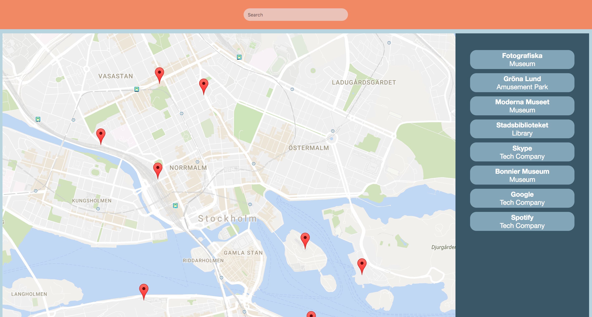

# Udacity FEND - P5: Neighborhood Map Project

This project combines a map, a list and a search function, working together.
The technologies used are:
*   Google Maps API
*   Knockout.js
*   jQuery/AJAX
*   Foursquare API



### Development Dependencies

*   Grunt
*   Bower

### Running the app

*   Open the app at <http://pmrcunha.github.io/udacity_p5/>

### Building the app

1.  Run ```bower install``` and ```npm install``` to install the project's dependencies, specified in bower.json and package.json.

2.  Run ```grunt``` to create the built project.

3.  Open the app at build/index.html, using a browser.
